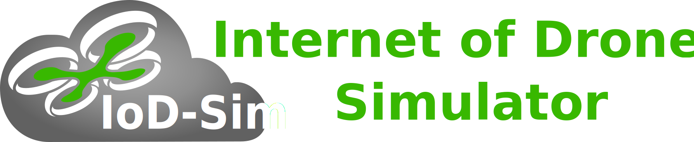

[IoD_Sim](https://telematics.poliba.it/iod-sim) is an open source and
system-level simulator for the IoD ([Internet of
Drones](https://ieeexplore.ieee.org/document/7423671)).

Developed on top of the well-known [ns-3](https://www.nsnam.org/) (Network
Simulator 3), it implements the key networking elements (drones, network access
points, and Zone Service Provider), a standard-compliant communication stack
based on the IEEE 802.11 and LTE technology, and scenarios with various mobility
models.

The source code presents the implementation of models and examples scripts,
also known as _scenarios_, that use such models to simulate a variable number
of drones that:

- Move according to the mobility model associated to the reference scenario.
- Exchange messages with network access points deployed on a cartesian or geographic 3D space.

For more details on how IoD_Sim works and all its features, the following
research publications are highly recommended:

- [G. Grieco, G. Iacovelli, P. Boccadoro and L. A. Grieco, "Internet of Drones Simulator: Design, Implementation, and Performance Evaluation," in IEEE Internet of Things Journal, vol. 10, no. 2, pp. 1476-1498, 15 Jan.15, 2023, doi: 10.1109/JIOT.2022.3207324.](https://doi.org/10.1109/JIOT.2022.3207324)
- [G. Grieco, G. Iacovelli, M. Sandri, M. Giordani, M. Zorzi and L. A. Grieco, "Preliminary Performance Evaluation of a
  Satellite-to-HAP Communication Link," European Wireless 2023; 28th European Wireless Conference, Rome, Italy, 2023,
  pp. 340-345.](https://ieeexplore.ieee.org/abstract/document/10461435)
- [G. Grieco, G. Iacovelli, D. Pugliese, D. Striccoli and L. A. Grieco, "A System-Level Simulation Module for Multi-UAV IRS-Assisted Communications," in IEEE Transactions on Vehicular Technology, vol. 73, no. 5, pp. 6740-6751, May 2024, doi: 10.1109/TVT.2023.3342298.](https://dx.doi.org/10.1109/TVT.2023.3342298)

Older publications that might still be useful:

- [G. Grieco, R. Artuso, P. Boccadoro, G. Piro and L. A. Grieco, "An Open Source and System-Level Simulator for the Internet of Drones," 2019 IEEE 30th International Symposium on Personal, Indoor and Mobile Radio Communications (PIMRC Workshops), Istanbul, Turkey, 2019, pp. 1-6, doi: 10.1109/PIMRCW.2019.8880832.](https://ieeexplore.ieee.org/document/8880832)

You can head over to the [Releases](releases) section to download a copy of a
stable version of the software.

The IoD_Sim repository is where this software is developed and there are many
ways in which you can participate in the project, for example:

- [Submit bugs and feature requests](issues) and help us verify as they are
  checked in.
- Review [source code changes](pulls).
- Review the [documentation](doc) and make pull requests for anything, from
  typos to new content.

IoD_Sim is primarily compatible with **Linux**-based operating systems. You can
test it on macOS, altough we are not focused on providing first-class support
for it. For macOS, Windows, or any other operating system, you are encouraged
to use [Docker](https://www.docker.com/),
[WSL](https://docs.microsoft.com/en-us/windows/wsl/about) or any other
(pseudo)virtualization platform that can provide you a stable Linux-based work
environment. You are welcome to provide new compatibility solutions any time.

Want to build scenarios through a GUI? [Airflow](https://github.com/GiovanniGrieco/IoD_Sim-airflow)
is a Visual Programming Editor ad-hoc for IoD_Sim! It relies on
[splash](https://github.com/GiovanniGrieco/IoD_Sim-splash) to transpile C++
models in Python visual blocks.

## Getting Started

The following quick start has been tested on Ubuntu 22.04 LTS. Please note that
this process may be similar in other distros as well. In case of any difficulties,
you are welcome to raise a pull request and propose some adjustments.

First of all, clone this repository, then open the folder with VSCode and execute
the following tasks:

1. Install dependencies,
2. Integrate IoD Sim with ns3
3. Configure IoD Sim
4. Build IoD Sim

Otherwise, run the following commands:

```
./tools/install-dependencies.sh
./tools/prepare-ns3.sh
cd ns3/
./ns3 configure --enable-examples --disable-mpi --disable-python --enable-modules=iodsim
./ns3 build
```

To run a JSON scenario configuration, execute the following command:

```
cd ns3/
./ns3 run iodsim -- --config=../scenario/simple_wifi.json
```

## Generate documentation

Before proceeding with the simulator, it may be helpful to generate the respective documentation. IoD_Sim relies on the [Doxygen](https://www.doxygen.nl/index.html) tool, which should already be installed with the other dependencies (if not, refer to the specific installation procedure for your distribution).

The documentation can be generated in HTML and LaTeX formats by running:

```
doxygen ./docs/IoD_Sim_doc
```

## Working with docker

After creating your own scenario through the JSON file, you can use [Docker](https://docs.docker.com/engine/) to quickly proceed to simulation in a few steps. The first time, the container image must be built by running the following command in the main directory of the repository:

```
docker build . -t docker_iod_sim
```

Next, the simulation can be run by launching:

```
sudo docker run --rm -v ./results:/IoD_Sim/results -v ./scenario:/IoD_Sim/scenario docker_iod_sim [--help] <simulation_file_name>
```

When completed, the `results` folder will contain the results of the simulation. It should be noted that if a new scenario is placed in `./scenario`, there will be no need to rebuild the container.

## License

Copyright (C) 2018-2024 [The IoD_Sim Authors](AUTHORS).

This program is free software; you can redistribute it and/or modify
it under the terms of the GNU General Public License as published by
the Free Software Foundation; either version 2 of the License, or
(at your option) any later version.

This program is distributed in the hope that it will be useful,
but WITHOUT ANY WARRANTY; without even the implied warranty of
MERCHANTABILITY or FITNESS FOR A PARTICULAR PURPOSE. See the
[GNU General Public License](LICENSE) for more details.

You should have received a copy of the GNU General Public License along
with this program; if not, write to the Free Software Foundation, Inc.,
51 Franklin Street, Fifth Floor, Boston, MA 02110-1301 USA.
