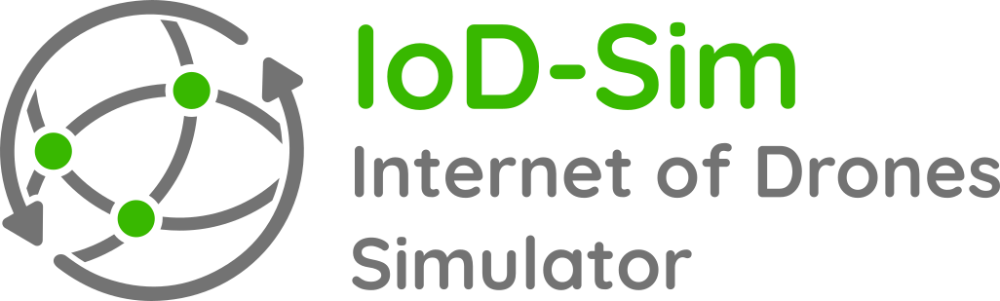

[IoD_Sim](https://telematics.poliba.it/iod-sim) is an open source and
system-level simulator for the IoD ([Internet of
Drones](https://ieeexplore.ieee.org/document/7423671)).

Developed on top of the well-known [ns-3](https://www.nsnam.org/) (Network
Simulator 3), it implements the key networking elements (drones, network access
points, and Zone Service Provider), a standard-compliant communication stack
based on the IEEE 802.11 technology, and scenarios with various mobility
models.

The source code presents the implementation of models and examples scripts,
also known as _scenarios_, that use such models to simulate a variable number
of drones that:
* Move according to the mobility model associated to the reference scenario.
* Exchange messages with network access points deployed on a generic and flat
  3D space.

The IoD_Sim repository is where this
software is developed and there are many ways in which you can participate in
the project, for example:
* [Submit bugs and feature requests](issues) and help us verify as they are
  checked in.
* Review [source code changes](pulls).
* Review the [documentation](doc) and make pull requests for anything, from
  typos to new content.

IoD_Sim is primarily compatible with **Linux**-based operating systems. You can
test it on macOS, altough we are not focused on providing first-class support
for it. For macOS, Windows, or any other operating system, you are encouraged
to use [Docker](https://www.docker.com/),
[WSL](https://docs.microsoft.com/en-us/windows/wsl/about) or any other
(pseudo)virtualization platform that can provide you a stable Linux-based work
environment. You are welcome to provide new compatibility solutions any time.

For more details, a dedicated publication that describes the entire simulation platform is available on [arXiv](https://arxiv.org/abs/2203.13710).

Want to build scenarios through a GUI? [Airflow](https://github.com/GiovanniGrieco/IoD_Sim-airflow) is a Visual Programming Editor ad-hoc for IoD_Sim! It relies on [splash](https://github.com/GiovanniGrieco/IoD_Sim-splash) to transpile C++ models in Python visual blocks.

## Getting Started

The following quick start has been tested on Ubuntu 22.04 LTS. Please note that this process may be similar in other distros as well. In case of any difficulties, you are welcome to raise a pull request and propose some adjustments.

First of all, clone this repository, then open the folder with VSCode and execute the following tasks:
1. Install dependencies,
2. Integrate IoD Sim with ns3
3. Configure IoD Sim
4. Build IoD Sim

Otherwise, run the following commands:
```
./tools/install-dependencies.sh
./tools/prepare-ns3.sh
cd ns3/
./ns3 configure --build-profile=debug --enable-examples --disable-mpi --disable-python --enable-modules=iodsim
./ns3 build
```

To run a JSON scenario configuration, execute the following command:
```
cd ns3/
./ns3 run "iodsim --config=../scenario/simple_wifi.json"
```

## License

Copyright (C) 2018-2023 [The IoD_Sim Authors](AUTHORS).

This program is free software; you can redistribute it and/or modify
it under the terms of the GNU General Public License as published by
the Free Software Foundation; either version 2 of the License, or
(at your option) any later version.

This program is distributed in the hope that it will be useful,
but WITHOUT ANY WARRANTY; without even the implied warranty of
MERCHANTABILITY or FITNESS FOR A PARTICULAR PURPOSE.  See the
[GNU General Public License](LICENSE) for more details.

You should have received a copy of the GNU General Public License along
with this program; if not, write to the Free Software Foundation, Inc.,
51 Franklin Street, Fifth Floor, Boston, MA 02110-1301 USA.
